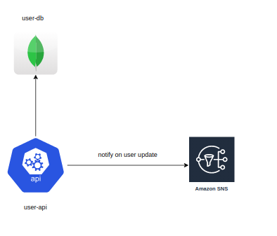

# User microservice api (CRUD)

### Technologies used

* JAVA 11
* Spring boot 2.3.1
* Cache(Caffeine)
* Mongo 4.1
* Maven
* Junit 5
* ELK stack for logs
* Docker
* Docker-compose
* SNS
* Swagger

### How to Run
 * Running local with everything on a container :
 `./mvnw clean package` 
 `cd deps`
 `docker-compose build`
 `docker-compose up -d`
 
 * You can edit the docker-compose yml and add a new-relic license key to see/monitoring the api at newrelic.
 * You can see logs on a local kibana at http://localhost:5601 just need to create an index on kibana for be able to 
 look at the logs.
 * You can the api endpoints at http://localhost:8080/swagger-ui.html
 
 * Running jar with only mongo and localstack on a docker: 
  `./mvnw clean package` 
   `cd deps`
  `docker-compose up -d localstack mongo` 
  `java -jar target/user-0.0.1-SNAPSHOT.jar`
  
 * For be able to read messages sent to SNS I create a consumer on localstack when the container is up,
 so it's possible to list messages using aws client with command 
  `aws --region=us-east-1 --endpoint-url=http://localhost:4576 sqs receive-message --queue-url http://localhost:4576/user_notify_queue_1` 

 
### Some assumptions
* The api will only be called to update with the full body(that's why only have PUT and not PATCH endpoint)
* The password need to be protected to be showed and to save on a database, so the password is salted before sent to mongo
* Need to receive all infos from a user(can't receive any field blank)
* There is no need to reprocess the notifications from an updated user.

### Possible Extensions
* Sharing the cache between instances using a redis on aws.  

### API Doc

The user api communicates with a mongodb. When the api receives a put to update a user, it notify to a SNS server 
for others consumers.